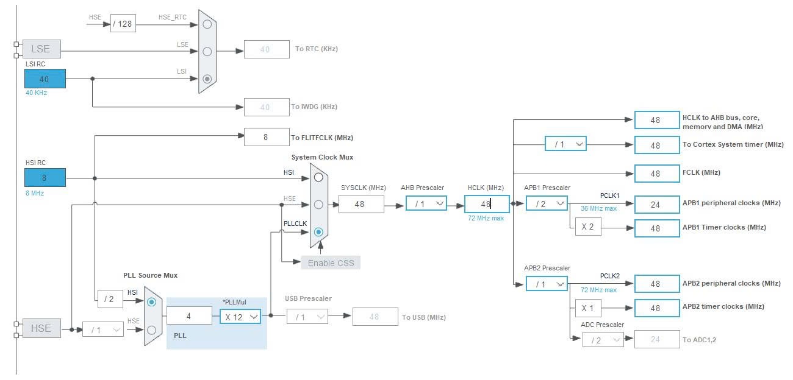
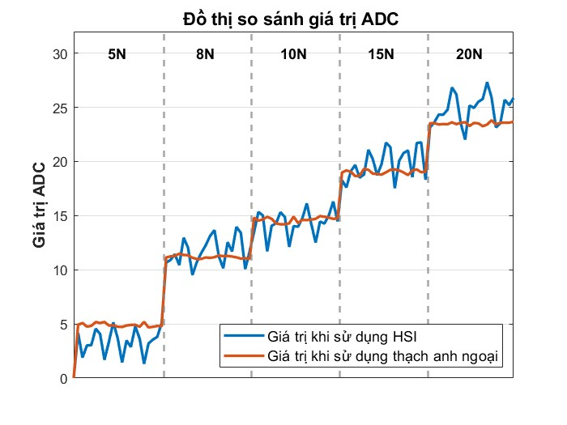
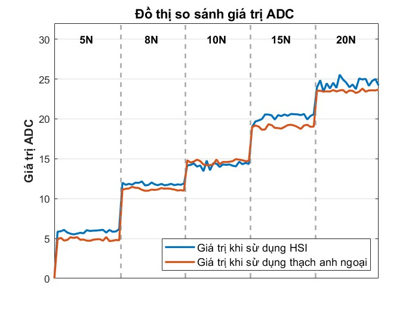

# Báo cáo tiến độ nghiên cứu ngày 22/08/2026
## A. Công việc đã làm
- Sửa code khi không dùng đến thạch anh ngoại
- Tìm hiểu nguyên lí và Vẽ mạch tích hợp stm32 cho cảm biến
## B. Khó Khăn
## C. Báo cáo chi tiết 
### 1. Sửa code không dùng thạch anh ngoại.
#### Code cấu hình clock hệ thống 48MHz từ HSI thông qua PLL:
```cpp
extern "C" void SystemClock_Config(void) {
  RCC_OscInitTypeDef RCC_OscInitStruct = {0};
  RCC_ClkInitTypeDef RCC_ClkInitStruct = {0};
  RCC_PeriphCLKInitTypeDef PeriphClkInit = {0};

  // 1. HSI 8MHz / 2 * 12 = 48MHz
  RCC_OscInitStruct.OscillatorType = RCC_OSCILLATORTYPE_HSI;
  RCC_OscInitStruct.HSIState = RCC_HSI_ON;
  RCC_OscInitStruct.HSICalibrationValue = RCC_HSICALIBRATION_DEFAULT;
  RCC_OscInitStruct.PLL.PLLState = RCC_PLL_ON;
  RCC_OscInitStruct.PLL.PLLSource = RCC_PLLSOURCE_HSI_DIV2;
  RCC_OscInitStruct.PLL.PLLMUL = RCC_PLL_MUL12; // 48MHz
  HAL_RCC_OscConfig(&RCC_OscInitStruct);

  // 2. Bus APB1 = 24MHz, APB2 = 48MHz (Latency = 1)
  RCC_ClkInitStruct.ClockType = RCC_CLOCKTYPE_HCLK | RCC_CLOCKTYPE_SYSCLK
                              | RCC_CLOCKTYPE_PCLK1 | RCC_CLOCKTYPE_PCLK2;
  RCC_ClkInitStruct.SYSCLKSource = RCC_SYSCLKSOURCE_PLLCLK;
  RCC_ClkInitStruct.AHBCLKDivider = RCC_SYSCLK_DIV1;
  RCC_ClkInitStruct.APB1CLKDivider = RCC_HCLK_DIV2;
  RCC_ClkInitStruct.APB2CLKDivider = RCC_HCLK_DIV1;
  HAL_RCC_ClockConfig(&RCC_ClkInitStruct, FLASH_LATENCY_1);

  // 3. ADC Clock = 48MHz / 4 = 12MHz
  PeriphClkInit.PeriphClockSelection = RCC_PERIPHCLK_ADC;
  PeriphClkInit.AdcClockSelection = RCC_ADCPCLK2_DIV4;
  HAL_RCCEx_PeriphCLKConfig(&PeriphClkInit);

  SystemCoreClockUpdate();
}
```
#### Giải thích code:
```cpp
RCC_OscInitTypeDef RCC_OscInitStruct = {0};
RCC_ClkInitTypeDef RCC_ClkInitStruct = {0};
RCC_PeriphCLKInitTypeDef PeriphClkInit = {0};
```
- RCC_OscInitStruct: Cấu hình nguồn tạo dao động (HSI/HSE/PLL).
- RCC_ClkInitStruct: Cấu hình xung nhịp cho lõi CPU (SYSCLK/HCLK) và các bus ngoại vi (APB1, APB2).
- PeriphClkInit: Cấu hình xung nhịp chuyên biệt cho các ngoại vi riêng lẻ (ở đây là ADC).
```cpp
RCC_OscInitStruct.OscillatorType = RCC_OSCILLATORTYPE_HSI;
```
- Cấu hình nó là bộ dao động nội HSI.
```cpp
RCC_OscInitStruct.HSIState = RCC_HSI_ON;
```
- Bật mạch dao động nội HSI hoạt động.
```cpp
RCC_OscInitStruct.HSICalibrationValue = RCC_HSICALIBRATION_DEFAULT;
```
- Ép tần số dao động nội HSI chạy chính xác nhất ở mức 8 MHz, tránh sai số tốc độ và thời gian.
```cpp
RCC_OscInitStruct.PLL.PLLState = RCC_PLL_ON;
```
- Bật bộ nhân tần số PLL để nhân tần số gốc lên mức cao hơn.
```cpp
RCC_OscInitStruct.PLL.PLLSource = RCC_PLLSOURCE_HSI_DIV2;
```
- Chọn đầu vào cho PLL: Lấy xung từ HSI và chia đôi.
- 8MHz / 2 = 4MHz.
```cpp
RCC_OscInitStruct.PLL.PLLMUL = RCC_PLL_MUL12;
```
- Đặt hệ số nhân của bộ PLL là 12. Lúc này tần số đầu ra của PLL là: 4MHz x 12 = 48MHz.
```cpp
HAL_RCC_OscConfig(&RCC_OscInitStruct);
```
- Ghi tất cả tham số trên vào khối quản lí xung nhịp RCC để áp dụng cấu hình dao động.
```cpp
RCC_ClkInitStruct.ClockType = RCC_CLOCKTYPE_HCLK | RCC_CLOCKTYPE_SYSCLK
                            | RCC_CLOCKTYPE_PCLK1 | RCC_CLOCKTYPE_PCLK2;
```
Chỉ định 4 nhánh xung nhịp cần cấu hình:
- SYSCLK: Xung nhịp chính của hệ thống.
- HCLK: Xung nhịp cấp cho lõi CPU Cortex-M3, bộ nhớ RAM, Flash và DMA.
- PCLK1: Xung nhịp cấp cho các ngoại vi trên bus APB1 (TIM2, TIM3, I2C, USART2,...).
- PCLK2: Xung nhịp cấp cho các ngoại vi trên bus APB2 (GPIO, ADC, USART1, SPI1,...).
```cpp
RCC_ClkInitStruct.SYSCLKSource = RCC_SYSCLKSOURCE_PLLCLK;
```
- Nguồn phát cho xung nhịp chính (SYSCLK) lấy trực tiếp từ đầu ra của bộ PLL 48MHz.
```cpp
RCC_ClkInitStruct.AHBCLKDivider = RCC_SYSCLK_DIV1;
```
- Xung nhịp cấp cho CPU là : 48MHz / 1 = 48 MHz.
```cpp
RCC_ClkInitStruct.APB1CLKDivider = RCC_HCLK_DIV2;
```
- Bộ chia Bus APB1 đặt là 2 => Xung nhịp cấp cho ngoại vi APB1 là : 48MHz / 2 = 24MHz.
```cpp
RCC_ClkInitStruct.APB2CLKDivider = RCC_HCLK_DIV1;
```
- Bộ chia bus APB2 đặt là 1 => Xung nhịp cấp cho ngoại vi APB2 là : 48MHz / 1 = 48MHz.
```cpp
HAL_RCC_ClockConfig(&RCC_ClkInitStruct, FLASH_LATENCY_1);
```
- FLASH_LATENCY_1: Đặt độ trễ đọc bộ nhớ Flash là 1 chu kỳ chờ . Bộ nhớ Flash tích hợp có tốc độ đọc giới hạn 24MHz; khi CPU chạy ở 48MHz, bắt buộc phải thêm 1 chu kỳ trễ để việc nạp lệnh từ Flash không bị sai lệch dữ liệu.
- Ghi cấu hình phân phối xung nhịp vào phần cứng.
```cpp
PeriphClkInit.PeriphClockSelection = RCC_PERIPHCLK_ADC;
```
- Cấu hình xung nhịp cho khối ADC.
```cpp
PeriphClkInit.AdcClockSelection = RCC_ADCPCLK2_DIV4;
```
- Lấy xung từ bus APB2 48MHz chia cho 4 để cấp cho ADC: 48MHz / 4 = 12MHz (Do fADC <= 14MHz).
```cpp
HAL_RCCEx_PeriphCLKConfig(&PeriphClkInit);
```
- Áp dụng bộ chia ADC vào thanh ghi RCC_CFGR.
```cpp
SystemCoreClockUpdate();
```
- Cập nhật biến xung nhịp thời gian thực.
#### Lí do chọn clock này:
- Tạo ra xung nhịp ADC 12MHZ giống khi mình dùng thạch anh ngoại.
- Tốc độ xử lý vẫn đủ nhanh.
#### Hình ảnh tổng quan clock
<div align="center">



</div>

#### Xử lí lại hàm đo
```cpp
ADCTouchSensor* pressure1 = nullptr;
```
- Khai báo biến con trỏ toàn cục: Cấp phát một ô nhớ địa chỉ rỗng , chưa can thiệp vào thanh ghi phần cứng.
- Tránh việc vi điều khiển tự động kích hoạt Constructor của cảm biến trước khi hàm cấu hình xung nhịp SystemClock_Config chạy xong.
```cpp
pressure1 = new ADCTouchSensor(PA0, PA1, 50);
```
- Đối tượng sẽ được cấp phát an toàn bên trong hàm setup() sau khi hệ thống đã ổn định ở tần số 48MHz.
#### Đồ thị so sánh các giá trị giữa code dùng thạch anh ngoại và thạch anh nội:
##### Khi dùng 100 mẫu với thời gian 22ms:
<div align="center">



</div>

##### Khi dùng 90 mẫu với thời gian 20ms:
<div align="center">



</div>

### 2. Mạch tích hợp stm32
- Kích thước 40mmx40mm
- Phần schematic và 3d của mạch:
<https://drive.google.com/file/d/1dbz9rPhS7_fd7J9rCNb8mQ3JylEotMxW/view?usp=sharing>
- Phần thiết kế mạch chi tiết:
<https://drive.google.com/drive/folders/17HoSClDFdHPtoJwHnZKkHMrE64iNjhzM?usp=sharing>

### 3. Một số shop đặt mạch tham khảo
- <https://shopee.vn/S%E1%BA%A3n-xu%E1%BA%A5t-PCB-ch%E1%BA%A5t-l%C6%B0%E1%BB%A3ng-cao-%E2%80%93-MOQ-5-T%C3%B9y-ch%E1%BB%89nh-m%C3%A0u-mi%E1%BB%85n-ph%C3%AD-B%E1%BA%A3ng-%C4%91%C6%A1n-%C4%91%C3%B4i-v%C3%A0-nhi%E1%BB%81u-l%E1%BB%9Bp-i.1135296432.28315488514?utm_source=chatgpt.com&zarsrc=30&utm_medium=zalo&utm_campaign=zalo>
- <https://shopee.vn/L%C3%A0m-M%E1%BA%A1ch-In-PCB-i.42338034.41103014855?utm_source=chatgpt.com&zarsrc=30&utm_medium=zalo&utm_campaign=zalo>
- <https://shopee.vn/In-M%E1%BA%A1ch-In-PCB-Theo-File-S%E1%BB%91-L%C6%B0%E1%BB%A3ng-%C3%8Dt-i.1404458001.43409406541?utm_source=chatgpt.com&zarsrc=30&utm_medium=zalo&utm_campaign=zalo>
- <https://vnpcb.com/?utm_source=chatgpt.com&zarsrc=30&utm_medium=zalo&utm_campaign=zalo>


